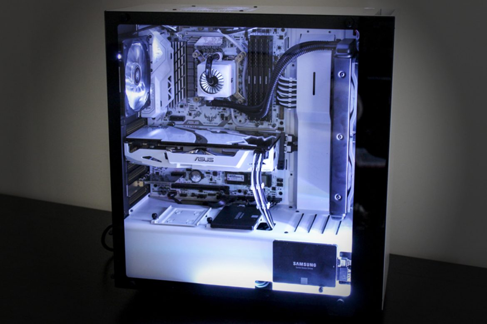

Ever since I've touch a computer and gaming console as a kid, I was curious of how software and games were made. Being able to study how they did it is amazing because as I am learning about one topic, another topic pops up and I am consistently amazed at how coding came to be. Being able to learn coding is a dream come true for the young me.

I didn't always choose Computer Science as my major. At first I was a psychology major, then a travel industry management major, but none of those majors made me feel like it was something I want to study for a long time. But then I realized I always loved gaming and looking up computer parts, I realized that computer science was the major for me. I love building computers but it amazed me even more when we started coding in ICS 111. It opened my eyes to how big the coding world is. It is like a golden opportunity for the world to use their imagination and make their own programs.

Growing up to love games, I am especially intersting in learning how to develop video games, I was already given an opportunity to test out my skills by creating a simple game in ICS 111, but I want to see how far I could take this. I hope that I’ll be able to enroll in classes that go into more depth regarding this topic or hardware class because building computers is a big hobby of mine.

I know that a class I will be struggling with would be math and algorithm class. Unforunately, there will be more class like this in the future so I know I have to brush up on my skills. Hopefully it won't take time away from my other classes. Hoping I can balanced my schedule out this semester because I'm taking software engineering and an algorithm class.

I am currently taking my first Software Engineering class. I'm hope to learn a lot through the course and pass all the WODs, I know I will need a lot of practice. I know it's only the middle of my college years, but it's only the beginning of learning how to code. By the time I’m done with it, hopefully I’ve learned enough to take the next step in my life as a developer or whatever I decide to choose later on.

