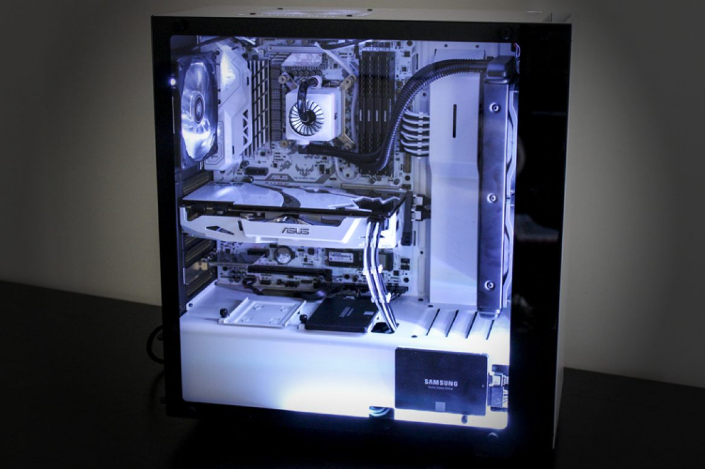

Ever since I've touch a computer and gaming console as a kid, I was curious of how software and games were made. Being able to study how they did it is amazing because as I am learning about one topic, another topic pops up and I am consistently amazed at how coding came to be. Being able to learn coding is a dream come true for the young me.

I didn't always choose Computer Science as my major. At first I was a psychology major, then a travel industry management major, but none of those majors made me feel like it was something I want to study for a long time. But then I realized I always loved gaming and looking up computer parts, I realized that computer science was the major for me. I love building computers but it amazed me even more when we started coding in ICS 111. It opened my eyes to how big the coding world is. It is like a golden opportunity for the world to use their imagination and make their own programs.

Growing up to love games, I am especially intersting in learning how to develop video games, I was already given an opportunity to test out my skills by creating a simple game in ICS 111, but I want to see how far I could take this. I hope that I’ll be able to enroll in classes that go into more depth regarding this topic or hardware class because building computers is a big hobby of mine.
Sometimes we are afraid to speak up and ask questions. However, asking questions is a form of learning and it shows that we are engaged in learning the topic.
