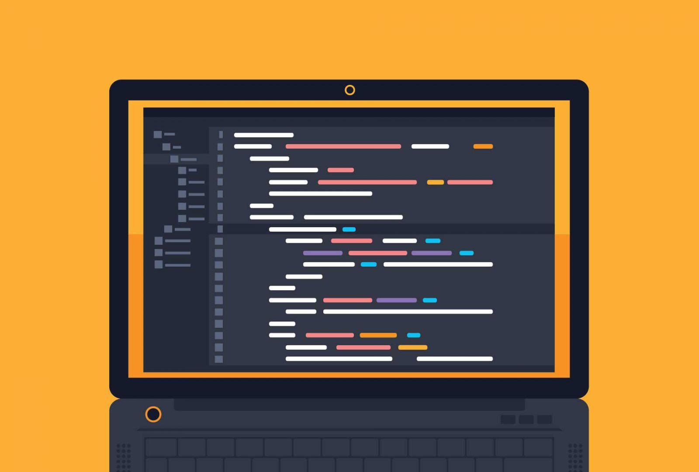

ICS314 is the first class that I have encountered Javascript, I think it's a good language, the biggest difference that I could tell from Java and C++, is that there is not a lot of ways to initialize a variable. For example, instead of using "char","int","float" to call a variable, javascript only uses let and const. Which I think is better in a lot of cases because it becomes less confusing later on when there's thousands lines of code. The practice on Free Code Camp was a good start, and most of the things I learned in the past could be used in this new language which is helpful. 

I can't really give my opinion on if Javascript is a good language for software engineering because I don't think I am proficent enough at it yet. But I feel like it is a lot more simpler than Java and C++ based of just initializing variable itself. I think I will enjoy coding on javascipr more than C++, because I just felt like C++ was a mess to code in, but maybe it might be my lack of practice.

I think atheltic software engineering is a good idea, it's a good style of learning, but I'm not sure if it is a good style I could benefit from. I usually like to take my time to solve a coding problem instead of rushing through it. But I know I have to get use to it because the amount of time I will having in an interview is limited. Therefore, it will be helpful in a work environment, but as of right now, I still have to get used to it.

This style of learning is a lot more stressful, especially the WODs because of the time restriction on the problems in class. Compared to the homework, the WODs in class makes me panic. It gets very stressful for me after I ran into one error, and it's hard for me to recover from it because I would just be stuck in the same error for a long time. It's enjoyable if I can solve it, if not, not so much. I hope the in-class WODs would work for me, I am still in the process of getting use to it but I know they are beneficial to my coding skills, being restricted to finish it in a time frame.
