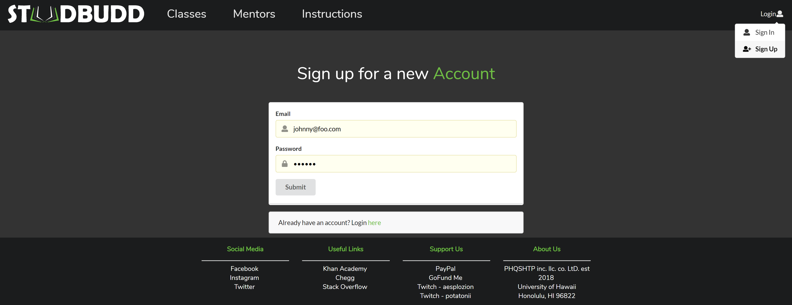
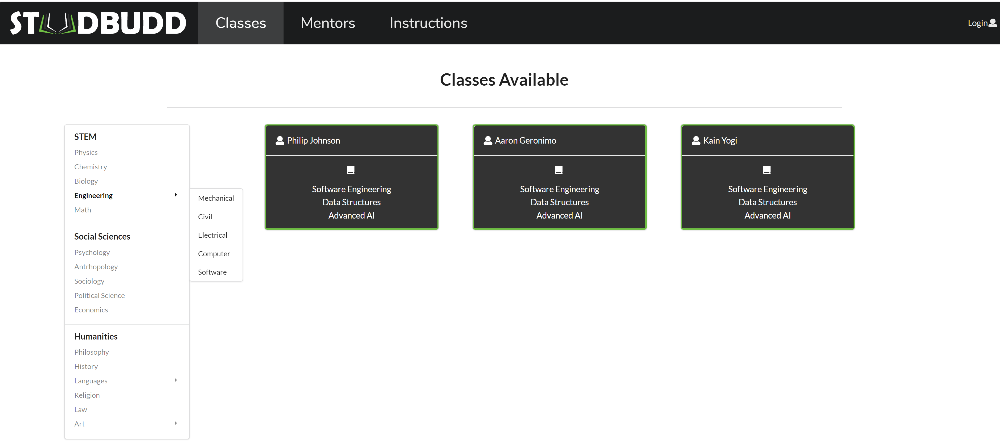
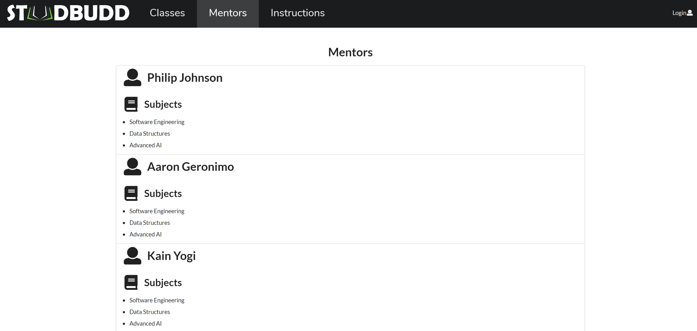
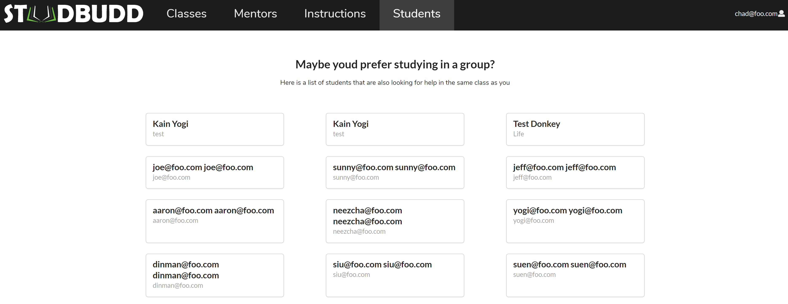

[Our current StudBudd Web App](http://studbudd.meteorapp.com/#/)

# StudBudd Goals

Our goal for StudBudd is to create a Meteor application to provide the students of  the University of Hawaii with an opportunity to list courses they have taken for which they are willing to attempt to provide help. Also courses they are currently taking for which they might need help in.

# User Guide

When you first visit the page, you will be greeted by our Landing Page!

Anyone from the UHM or even outside of the university can create an account to search for help.

Once you are signed in, you can visit the Classes page. You will be greeted by an empty page with a list of classes on the left. Clicking on a class will display a list of mentors that are proficient in that class.

You can also visit the mentors page, in which you will be greeted with a full list of all of the available mentors and the subjects they are offering mentoring in. 

If you are logged in as a mentor or student, Visiting the students page will display all the students and the subjects they are looking for help in. When a student is clicked, you will be redirected to their profile. From there, as a mentor you can offer help. As a student, you can plan group study sessions that student if you need help in the same subject.

# Community Feedback
UH alumni,Brandon Chun, said to change the title for visibility and edit the mentor card so the so information is more clear, and to range our pages. He also was not thrilled with the name 'StudBudd' and recommended 'StudMuffin'. Other comments,from another former UH student, focused on the aesthetics of the cite, and a few concerns about functionality. 

"The pages that have a darker background are easier on the eye but the landing page picture could be better." - Sean Brown, UH alumni 

"It looks like a great way to connect with peers and get help with classes that may be particularly tough." -Kahlin, UH student 

"Neat and organized, but the heading is a little hard to read." -Kailey, UH student 
